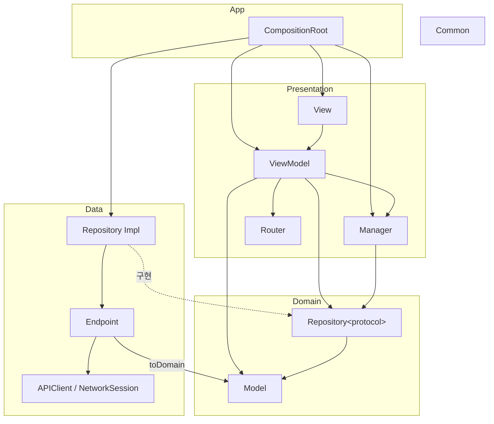
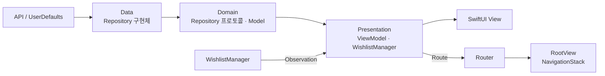

# 중고나라 사전과제

### 프로젝트 구조

Clean Architecture를 기반으로 `App` / `Presentation` / `Domain` / `Data` / `Common` 레이어로 폴더를 분리했고, 각 레이어 내부는 역할(타입)별로 나뉩니다.

- 실선(`-->`)은 참조/사용, 점선(`-.->`)은 프로토콜 구현을 의미합니다.

> [!NOTE]
> 과제 규모상 단일 타깃으로 구성했습니다. 폴더 구조와 의존성 방향으로 레이어 경계를 유지하며, 멀티 타깃/SPM 분리는 필요해질 때 도입할 예정입니다.

#### 주요 모듈

**App**

> [!NOTE]
> 의존성을 조립하고 앱 진입점을 구성합니다. `CompositionRoot`는 앱 실행 경로에서 `Domain`의 Repository 프로토콜에 `Data` 구현체를 연결해 `Presentation`에 주입합니다.

- `CompositionRoot`: Repository·Manager·ViewModel 등 의존성을 조립하고 주입하는 DI 루트.
- `RootView`: `NavigationStack`으로 `Router`의 경로를 관찰해 화면 전환을 렌더링하는 앱 진입 화면.

**Presentation**

> [!NOTE]
> 화면 상태를 만들고 사용자 입력을 처리합니다. `ViewModel`은 `Repository`/`Manager`를 구체 타입이 아닌 프로토콜로 주입받으므로 `Data`의 구현을 직접 알지 못합니다.

- `ProductListViewModel`: 상품 목록을 조회하고 로딩/빈 상태/에러 상태를 관리.
- `ProductListItemViewModel`: 목록 셀 하나의 상태(찜 여부 확인)와 선택·찜 토글 액션을 담당.
- `ProductDetailViewModel`: 단일 상품 상세를 조회하고 찜 여부 확인·토글을 담당.
- `WishlistManager`: 찜 상태를 앱 전역에서 공유하고 Observation으로 관찰 가능하게 제공.
- `Router`: 화면 push/pop 등 네비게이션 스택 전환을 담당.

**Domain**

> [!NOTE]
> 다른 레이어에 의존하지 않는 순수 계층입니다. Repository는 구현 없이 프로토콜만 정의하고, Model은 특정 화면·네트워크 형식에 종속되지 않는 비즈니스 모델만 담습니다.

- `ProductListRepository`(protocol): 상품 목록 조회 인터페이스.
- `ProductDetailRepository`(protocol): 상품 상세 조회 인터페이스.
- `WishlistRepository`(protocol): 찜 목록 추가/제거/조회 인터페이스.
- `Product`: 목록용 경량 상품 모델.
- `ProductDetail`: 상세 화면용 전체 필드 상품 모델.
- 그 외 상품 가격·치수·메타 정보·리뷰·재고 상태 모델.

**Data**

> [!NOTE]
> Domain Repository 프로토콜을 구현하고 실제 데이터 소스(API, `UserDefaults`)에 접근합니다.

- `ProductListRepositoryImpl`: `APIClient`로 목록을 조회하고 응답 모델을 `Product`로 변환.
- `ProductDetailRepositoryImpl`: `APIClient`로 상세를 조회하고 응답 모델을 `ProductDetail`로 변환.
- `WishlistRepositoryImpl`: `UserDefaults`에 찜한 상품 ID 목록을 영속화.
- `APIClient`: HTTP 요청 실행, 상태 코드 검증, 응답 디코딩 등 공통 네트워킹 처리.
- `ProductListEndpoint` / `ProductDetailEndpoint`: 요청 스펙(URL, 메서드, 쿼리) 정의 + 응답 모델 파싱 및 `toDomain()` 변환.

**Common**

> [!NOTE]
> 레이어에 종속되지 않는 공용 유틸리티를 둡니다.

- `DateFormatter`: ISO8601 날짜 파싱 등 레이어 무관 공용 유틸리티.

### 앱의 상태와 데이터가 화면에 전달되는 흐름

- **상품 조회**: View의 `.task`에서 `ViewModel.load()`를 호출하면, ViewModel이 Repository 프로토콜을 통해 데이터를 요청합니다. Data 레이어는 API 응답을 Domain 모델로 변환해 반환하고, ViewModel은 결과를 `loaded`·`empty`·`error` 상태로 갱신합니다. SwiftUI View는 `@Observable` ViewModel의 상태 변화를 관찰해 로딩·목록·빈 화면·에러 화면을 렌더링합니다.
- **찜 상태**: `WishlistManager`는 `UserDefaults` 기반 Repository에서 찜한 상품 ID를 불러와 Observation으로 관리합니다. 목록 아이템과 상세 ViewModel은 상품별 찜 여부를 조회해 같은 상태를 표시합니다. 사용자의 토글 입력은 Manager를 거쳐 저장소에 반영됩니다.
- **화면 전환**: 목록 아이템 선택 시 ViewModel이 `Router`에 상세 경로를 추가합니다. `RootView`의 `NavigationStack`이 `Router.path` 변화를 관찰해 상세 화면을 생성하며, `CompositionRoot`가 해당 화면에 필요한 의존성을 조립합니다.
- **동시 요청 처리**: 목록·상세 조회는 이전 요청을 취소하고 마지막 요청의 결과만 반영해, 늦게 도착한 이전 응답이 최신 화면 상태를 덮어쓰지 않도록 했습니다.

### 주요 기술적 판단

#### UseCase 생략

목록·상세 조회와 찜 추가·제거는 현재 별도 비즈니스 규칙 없이 하나의 Repository 호출로 처리됩니다. 이 흐름에 UseCase를 추가하면 단순 전달 역할만 하게 되어, 과제 규모에서는 계층과 테스트 대상을 불필요하게 늘린다고 판단했습니다.

`ViewModel`과 `WishlistManager`는 `Domain`에 정의한 Repository 프로토콜에만 의존하고, 구현은 `Data` 레이어가 담당합니다. 따라서 UseCase를 생략해도 `Presentation`이 `Data` 구현체를 직접 참조하지 않으며, 의존성 방향은 유지됩니다. 이후 여러 Repository를 조합하거나 권한·검증·정책 같은 비즈니스 규칙이 추가되면, 해당 흐름부터 UseCase로 분리할 예정입니다.

#### 목록·상세 모델 분리

목록 조회 API와 상세 조회 API는 모두 상품 정보를 반환하므로, 하나의 응답 모델과 도메인 모델을 공유할지 검토했습니다. 다만 목록 조회 API는 `select` 쿼리로 제목·가격·썸네일·평점 등 요약 필드만 요청하고, 상세 조회 API는 설명·치수·리뷰·배송 정보 등을 포함한 전체 필드를 반환합니다. 이에 따라 목록용 `Product`와 상세용 `ProductDetail`을 분리하고, 각 API 응답 모델도 Endpoint별로 분리했습니다.

목록 요청에는 `select` 쿼리로 필요한 필드만 요청합니다. 이를 통해 전송량과 디코딩·객체 생성 범위를 줄이고, 목록 화면이 상세 정보까지 보관하는 것을 방지했습니다. 상품 수가 늘어날수록 불필요한 메모리 사용도 함께 줄일 수 있습니다.

두 모델은 일부 필드를 중복하지만, 화면별 요구사항이 달라질 때 서로에게 영향을 주지 않고 변경할 수 있습니다. 공통 정보가 많아지고 두 화면의 사용 방식이 수렴하면, 그때 공통 모델을 추출하는 방향을 검토할 수 있습니다.

#### 상품 목록 아이템 ViewModel 분리

찜 상태의 원본과 저장 책임은 `WishlistManager`에 두고, `ProductListItemViewModel`은 개별 상품의 찜 여부를 조회해 표시 상태로 변환하도록 분리했습니다. 목록 ViewModel은 상품 목록 조회와 화면 상태에 집중하고, 아이템 ViewModel은 찜 상태 표시·토글·상세 이동처럼 셀 단위의 사용자 인터랙션을 담당합니다.

찜 상태가 변경되어도 목록 데이터를 다시 구성하지 않습니다. 각 아이템 ViewModel은 자신의 상품 ID로 `isWished`를 계산하며, 목록과 상세 화면은 같은 `WishlistManager`를 참조해 일관된 찜 상태를 표시합니다.

또한 아이템 ViewModel은 `WishlistManaging` 프로토콜을 주입받으므로, 목록 조회나 화면 구성 없이 찜 상태 변화와 사용자 액션을 독립적으로 테스트할 수 있습니다. 고유한 UUID를 식별자로 사용해 예외적으로 중복된 상품 ID가 전달되어도 목록 항목을 구분합니다.

#### 찜 저장소의 동시성 보장

찜 목록은 `UserDefaults`에 저장하지만, 추가·삭제는 기존 목록을 읽고 수정한 뒤 다시 저장하는 순서 의존 작업입니다. 동시에 여러 요청이 발생하면 마지막 저장이 이전 변경을 덮어쓸 수 있어 `WishlistRepositoryImpl`을 actor로 구현했습니다.

이를 통해 저장소 접근을 직렬화하고, 찜 상태의 읽기·수정·저장이 일관되게 처리되도록 했습니다.

#### 네트워크 의존성 추상화

`APIClient`는 `URLSession`을 직접 호출하지 않고 `NetworkSession` 프로토콜에 의존하도록 구성했습니다. 실제 앱에서는 `URLSession`을 사용하고, 테스트에서는 Mock Session을 주입해 네트워크 환경 없이 요청 생성·상태 코드 검증·디코딩 실패 처리를 검증할 수 있습니다.

또한 HTTP 상태 코드 오류와 디코딩 오류를 `APIError`로 구분해, 호출부가 실패 원인을 일관되게 처리할 수 있도록 했습니다.

### 개선하고 싶은 부분

시간이 더 주어진다면 개선하거나 추가하고 싶은 내용을 작성해 주세요.

### AI 활용 내역

AI 도구를 사용한 경우 아래 내용을 작성해 주세요.

- 사용한 AI 도구
- 어떤 작업에 AI를 활용했는지
- 어떤 질문이나 작업에 활용했는지
- AI가 생성한 결과를 그대로 사용했는지, 수정하여 적용했는지
- AI가 제안한 내용을 어떻게 검증했는지

AI 도구 사용 자체는 제한하지 않습니다. AI를 사용하지 않은 경우에는 사용하지 않았다고 작성해 주세요.
